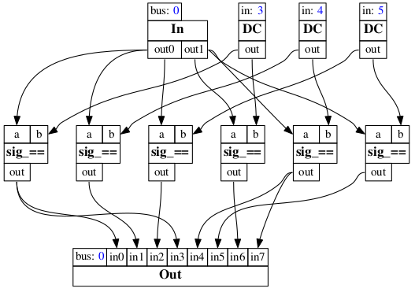

# ScalaCollider-Voices

[](https://travis-ci.org/iem-projects/ScalaCollider-Voices)
[](https://maven-badges.herokuapp.com/maven-central/at.iem/scalacollider-voices_2.11)

A library for [ScalaCollider](https://github.com/Sciss/ScalaCollider) to aids building polyphonic synth graphs.
This project is (C)opyright 2016 by the Institute of Electronic Music and Acoustics (IEM), Graz. 
Written by Hanns Holger Rutz. This software is published under the GNU Lesser General Public License v2.1+.

## linking

The following artifact is available from Maven Central:

    "at.iem" %% "scalacollider-voices" % v

__Not yet released!__ The current stable version `v` is `"0.1.0"`.

## building

This project builds with sbt 0.13 and Scala 2.11, 2.10. To compile `sbt test:compile`.

## contributing

Please see the file [CONTRIBUTING.md](CONTRIBUTING.md)

## documentation

__TODO__

### Auxiliary graph elements.

There are two auxiliary elements that aid `Voices`, and which will
probably be best put back into ScalaCollider soon.

`ChannelRangeProxy` is a straight forward extension of `ChannelProxy`
that takes a range of indices instead of a single index. So we can
grap sub-groups of channels of a signal.

`RepeatChannels` aids with the representation of the conditional
testing in the voice management, by allowing us to "bypass" the
regular multi-channel-expansion and instead eagerly pair the
channels of two signals. This way, we have a simple representation
(that can be serialised) of the matrix from which we select
condition groups in the actual expansion of the voices analysis.
For a full explanation, see the scala-doc comments of `RepeatChannels`,
but the following two diagrams should illustrate what is going on.
Imagine the regular MCE when two signals are combined:

```scala
SynthGraph {
  val in      = In.kr(0, 2)
  val state   = DC.kr(Seq(3, 4, 5))
  val all     = in sig_== state
  Out.kr(0, all)
}
```

This matches `in` and `state` to produce a signal that has the higher
of the two signals' channel numbers, so three channels. The expanded
UGen graph should be familiar and looks as follows:


We can now enforce a repetition of the channels of signal, for example
we can repeat every channel in `in` for the number of times that
corresponds to `state`'s number of channels:

```scala
SynthGraph {
  val in      = In.kr(0, 2)
  val state   = DC.kr(Seq(3, 4, 5))
  val num     = 4
  val inComb  = RepeatChannels(in, num)
  val all     = inComb sig_== state
  Out.kr(0, all)
}
```

The corresponding expanded UGen graph looks as follows:



It is now easy to see that we can "grab" for example, after the fact,
the equivalent of `(in \ 0) * state` which is
`ChannelRangeProxy(RepeatChannels(in, 3) * state, from = 0, until = 3)`
and the equivalent of `(in \ 1) * state` which is
`ChannelRangeProxy(RepeatChannels(in, 3) * state, from = 3, until = 6)`.
